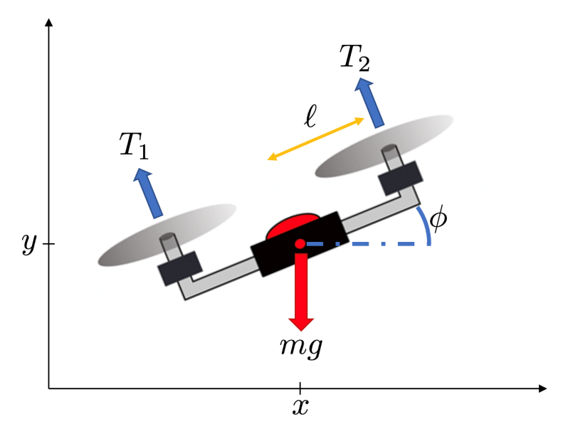
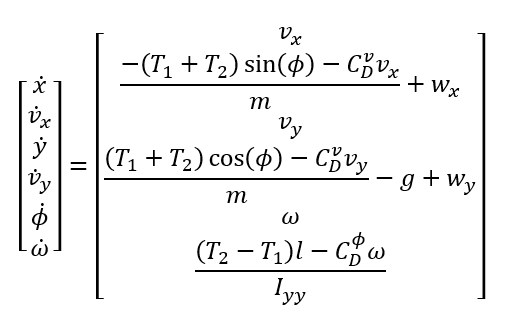
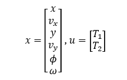
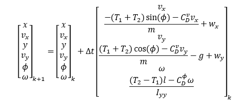
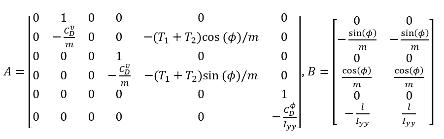
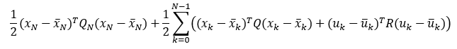

# Python Template Repository

# Running this

We use [conda](https://docs.anaconda.com/free/miniconda/miniconda-install/) to manage the environment. 

For creating an environment from the environment file:
```
conda env create --file env.yaml
```

For updating the environment file after making changes:
```
conda env export --no-builds | grep -v "^prefix: " > env.yaml
```

Can then run any of the main files like so:
```
conda activate madness
python src/main.py
```

# Initial 2D Dynamics

We will be modeling our manipulator-arm drone with quadrotor dynamics sourced from AA274A and AA203.



The dynamic model for this quadrotor is given by



Where 
* 	(x,y) is the position 
*	(v_x,v_y) is the translational velocity
*	ϕ is the pitch of the quadrotor
*	ω is the pitching rate of the quadrotor
*	(T_1,T_2) is the thrust from the rotors 
*	C_D^v is the translational drag
*	C_D^ϕ is the rotational drag
*	m is the mass
*	I_yy is the moment of inertia
*	l is half the length of the quadrotor
*	(w_x,w_y) is the wind velocity
*	g is the gravitational acceleration

We will define our state and control vectors as



First and foremost, our drone will operate in discrete time. Because of this, we need to convert our continuous time model to a discrete model. This can be accomplished with Euler discretized dynamics which will give us



We will be given a trajectory we wish to follow with this quadrotor. To accomplish this, we need a controller. Let’s use an optimal closed loop controller, say LQR. LQR is a great controller for linear tracking problems, but oh no! Our dynamics are nonlinear!

To use an LQR controller, we will need to linearize the dynamics. We can accomplish this by linearizing about the nominal trajectory. This will give us the model



Finally, we can pose the cost function for the LQR problem as



Since we are solving this over a trajectory of points, we will need to use iLQR techniques to solve the control problem.

# Links

For 3D visualization:

- https://www.vpython.org/
- https://www.panda3d.org/features/
- https://github.com/fwilliams/point-cloud-utils
- https://towardsdatascience.com/python-libraries-for-mesh-and-point-cloud-visualization-part-1-daa2af36de30
- https://towardsdatascience.com/python-libraries-for-mesh-point-cloud-and-data-visualization-part-2-385f16188f0f